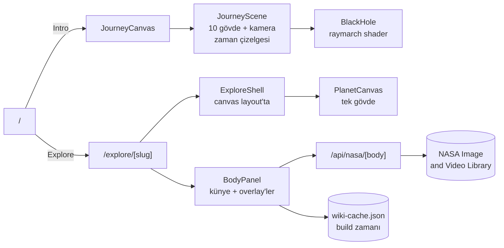

<div align="center">


# Solar System Journey

**Güneş'ten Neptün'e gerçek aralıklarla bir uçuş, ışığın bittiği yerde biten bir final,
ve on bir gövdeyi tek tek anlatan bir keşif modu.**

[](https://solar-system-journey-plum.vercel.app)
&nbsp;


</div>

---

## İçindekiler

- [Ne yapıyor](#ne-yapıyor)
- [Ekranlar](#ekranlar)
- [Nasıl çalışıyor](#nasıl-çalışıyor)
  - [Intro uçuşu](#intro-uçuşu)
  - [Sagittarius A\*](#sagittarius-a)
  - [Keşif modu](#keşif-modu)
- [Kare hızı](#kare-hızı)
- [Erişilebilirlik](#erişilebilirlik)
- [Kaynaklar ve lisanslar](#kaynaklar-ve-lisanslar)
- [Kurulum](#kurulum)
- [Script'ler](#scriptler)
- [Proje yapısı](#proje-yapısı)
- [Deploy](#deploy)

---

## Ne yapıyor

İki mod var, aynı sahne dilini paylaşıyorlar.

| | **Intro** | **Keşif** |
|---|---|---|
| Rota | `/` | `/explore/[slug]` |
| Ne | Güneş'ten Neptün'e ~20 saniyelik bir uçuş | Gövde başına tek sayfa, paylaşılabilir link |
| Aralıklar | **Gerçek**, 30 AU'ya kadar | — |
| Gösterge | Kat edilen yol (km / AU) ve hız (ışık hızının katı) | Ölçüler, metin, NASA arşivi |
| Final | Karanlık → ışık → kara delik | — |

Gövdeler: **Güneş, Merkür, Venüs, Dünya, Ay, Mars, Jüpiter, Satürn, Uranüs, Neptün** — ve
uçuşun sonunda on birincisi, **Sagittarius A\***.

---

## Ekranlar

<table>
<tr>
<td width="50%"></td>
<td width="50%"></td>
</tr>
<tr>
<td align="center"><sub><b>Ana sayfa</b> — uçuş ve keşif, tek karar</sub></td>
<td align="center"><sub><b>Keşif</b> — gövde sağda, künye solda</sub></td>
</tr>
<tr>
<td></td>
<td></td>
</tr>
<tr>
<td align="center"><sub><b>Final</b> — ışığın gerçekten büküldüğü bir kara delik</sub></td>
<td align="center"><sub><b>Detay</b> — ölçüler, metin, atıf</sub></td>
</tr>
</table>

---

## Nasıl çalışıyor



### Intro uçuşu

Kamera düz bir hat üzerinde ilerliyor; zaman çizelgesi **duraklama** ve **seyir**
fazlarının art arda dizilmesinden ibaret:

| Faz | Süre | Ne oluyor |
|---|---|---|
| Duraklama | 0,9 sn | Gövdenin yanından sabit hızla geçiş, kamera ona bakıyor |
| Seyir | 1,2 sn | Bir sonrakine `smoothstep` ile hızlanıp yavaşlayan geçiş |
| Karanlık | 2,4 sn | Sis yoğunluğu artıyor, yıldızlar sönüyor, ileride bir ışık büyüyor |
| Patlama | 0,5 sn | Kara delik 34 rs'den 13,5 rs'ye kapanıyor + sarsıntı + parlama |
| Duruş | 1,4 sn | Delik yerleşiyor, "End of the line" kartı iniyor |

Aralıklar gerçek: gövdeler `distanceKm / 1e6` konumunda duruyor, yani Neptün 4500 birim
ötede. Gövde yarıçapları ise mesafe ölçeğinin **10 katı** abartılı, yoksa hiçbiri
görünmezdi. Her gövdenin yanından yarıçapının 3,4 katı uzaktan geçiliyor, böylece hepsi
kadrajda aynı büyüklükte okunuyor — ve hiçbir geçiş komşusununkine taşmıyor (Ay,
Dünya'nın 0,38 birim arkasında).

> **Atla** düğmesi uçuşu hızlandırmıyor, **kesiyor**. Hızlandırma tüm sistemi bir saniyede
> gözün önünden geçiriyordu; ışığa duyarlı biri için riskli. Şimdi zaman doğrudan
> karanlığa atlıyor, dikişi 0,55 saniyelik bir karartma örtüyor.

### Sagittarius A\*

Final sprite hilesi değil. Fotonlar Schwarzschild alanında adım adım integre ediliyor:

```glsl
vec3 acc = -1.5 * h2 * p / pow(dot(p,p), 2.5);   // h2 = |p × v|²
v += acc * dt;  p += v * dt;
```

Işın ekvator düzlemini her kestiğinde disk örnekleniyor (2,35 – 16,5 rs), ufka düşen
ışınlar siyah kalıyor, kaçanlar prosedürel gökyüzünü okuyor. Diskin arkadan dolanıp
önden geçmesi, foton halkası, üstteki ve alttaki mercek kolları — hepsi bu integrasyonun
doğal sonucu, elle çizilmiş katman yok. Dönüş yönüne göre parlaklık farkı (Doppler
beaming) `beta = 0.72/√r` ile geliyor.

Adım sayısı masaüstünde **210**, mobilde **130**. Shader sahnedeyken piksel oranı 1,0'a
(mobilde 0,75) sabitleniyor; program açılışta görünmez tek bir karede derleniyor, böylece
patlama anında takılma olmuyor.

### Keşif modu

Canvas **layout'ta** duruyor, sayfa değil. Gövdeden gövdeye geçerken WebGL bağlamı
yeniden kurulmuyor, yalnızca sahnedeki gövde değişiyor. Gezinme dört yoldan aynı adımı
paylaşıyor: tekerlek (1,1 sn bekleme), ok tuşları, dokunmatik kaydırma, alt bardaki
ileri/geri. Komşu rotalar önden yükleniyor.

Detay penceresindeki paragraf **en.wikipedia** özetinden geliyor ve build zamanında
`src/data/wiki-cache.json`'a yazılıyor: pencere metinle birlikte açılıyor, ağ olmadan da
çalışıyor, metnin ne dediği diff'te görünüyor. 700 karakterde ve cümle sonunda kırpılıyor.
NASA görselleri ise canlı: sunucuda 24 saat cache'lenen bir route handler üzerinden.

---

## Kare hızı

Bu kısım sonradan düzeltildi ve düzeltmeler ölçülebilir:

| Sorun | Neydi | Ne oldu |
|---|---|---|
| HUD | Sayaçlar saniyede 60 kez `setState` çağırıyor, her seferinde 10 gezegenlik ağaç yeniden uzlaştırılıyordu | Değerler doğrudan DOM'a yazılıyor, canvas bileşenleri `memo`'lu — uçuş boyunca React ağacı hiç render edilmiyor |
| Doku belleği | Masaüstünde 4k harita + bulut + 4k yıldız alanı ≈ **130 MB** GPU | Ekrandaki gerçek piksele göre 1k/2k/4k seçiliyor, intro'da hepsi 1k → **~11 MB** |
| Piksel oranı | Sabit 1,5 (ekranın oranını aşabiliyordu) | Tavan değeri olarak veriliyor, `PerformanceMonitor` kare hızı düşerse 1'e çekiyor |

Ayrıca: anizotropi 8'le sınırlı, küre segmentleri mobilde 32 / masaüstünde 64, sahne
durgunken `frameloop="demand"`.

---

## Erişilebilirlik

- Overlay'lerde focus trap, `Escape` ile kapanma, odak geri veriliyor.
- Gezinme düğmelerinde `aria-label`, dokunma hedefleri mobilde 44 px.
- 3D canvas `aria-hidden`; tüm içerik DOM'da metin olarak da var, sayfalar statik HTML olarak üretiliyor.
- `prefers-reduced-motion`: gövde dönüşü, giriş animasyonu, kamera sarsıntısı ve patlama parlaması kapanıyor.
- Atlama düğmesi stroboskopik değil (yukarıya bakınız).

---

## Kaynaklar ve lisanslar

| Ne | Kaynak | Lisans |
|---|---|---|
| Yüzey haritaları | [Solar System Scope](https://www.solarsystemscope.com/textures/) | CC BY 4.0 |
| Detay metinleri | [Wikipedia](https://en.wikipedia.org) özetleri | CC BY-SA 4.0 |
| Fotoğraflar | [NASA Image and Video Library](https://images.nasa.gov) | NASA kullanım koşulları |
| Ölçüler | NASA gezegen bilgi föyleri | — |
| Kod | Bu depo | [MIT](LICENSE) |

Atıflar sitede de görünür: her detay penceresinin altında üç satır künye var.

Dokuların kendisi depoda türev olarak duruyor (`public/textures/{1k,2k,4k}`, webp,
toplam ~13 MB). Orijinaller `.cache/` altına iniyor ve git'e girmiyor.

---

## Kurulum

```bash
npm install
npm run dev     # http://localhost:3000
```

Depo, çalışması için gereken her şeyi içeriyor: dokular, Wikipedia önbelleği, ikonlar.
Ağ yalnızca NASA görselleri için gerekiyor, o da olmazsa pencere "No pictures on file" diyor.

## Script'ler

| Komut | Ne yapar |
|---|---|
| `npm run dev` | Turbopack ile geliştirme sunucusu |
| `npm run build` | Production build (10 gezegen sayfası statik) |
| `npm start` | Build'i sunar |
| `npm run lint` | ESLint (React Compiler kuralları dahil) |
| `node scripts/build-textures.mjs` | Dokuları indirir, 4k/2k/1k webp üretir |
| `node scripts/build-wiki.mjs` | Wikipedia özetlerini tazeler |

## Proje yapısı

```
src/
├── app/
│   ├── page.tsx                 intro uçuşu
│   ├── explore/
│   │   ├── layout.tsx           canvas burada yaşıyor
│   │   └── [slug]/page.tsx      gövde başına sayfa + metadata
│   ├── api/nasa/[body]/         NASA arama, 24 saat cache
│   ├── manifest.ts              PWA
│   └── icon.png · apple-icon.png · opengraph-image.png
├── components/
│   ├── journey/                 sahne, zaman çizelgesi, HUD
│   ├── explore/                 kabuk, gezegen canvas'ı, künye, overlay'ler
│   └── three/                   gövde, yıldızlar, kara delik, yükleyici
├── data/
│   ├── bodies.ts                ölçüler, metinler, doku ve wiki başlıkları
│   └── wiki-cache.json          build zamanında üretiliyor
├── lib/                         biçimleme, cihaz tercihleri, site URL'i
└── styles/                      Tailwind v4 teması + semantik class'lar
```

Stil tarafında tek kural var: JSX'te uzun utility zinciri yok. Renkler, tipografi ve
`clamp()` değerleri `@theme` içinde token, bileşenler `@apply` ile CSS'te kuruluyor.

## Deploy

Vercel'de ek ayar gerekmiyor; paylaşım kartının mutlak URL'i deploy alan adından
okunuyor. Başka bir yere kuruyorsan `NEXT_PUBLIC_SITE_URL` ayarla:

```bash
NEXT_PUBLIC_SITE_URL=https://alanadi.com
```

<div align="center">
<br />

<br /><br />
<sub>Made by Taner Talas</sub>
</div>
