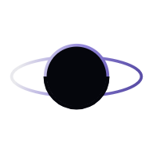
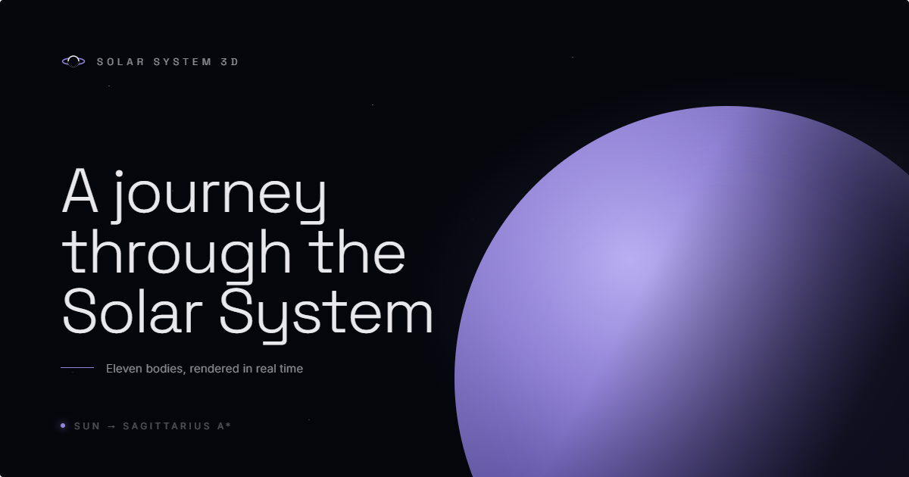
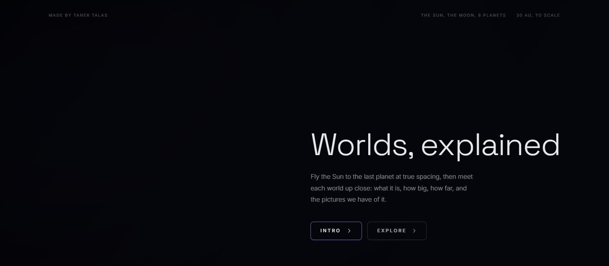
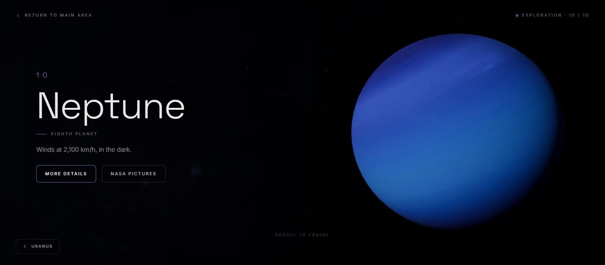
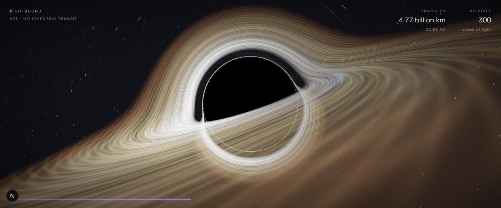
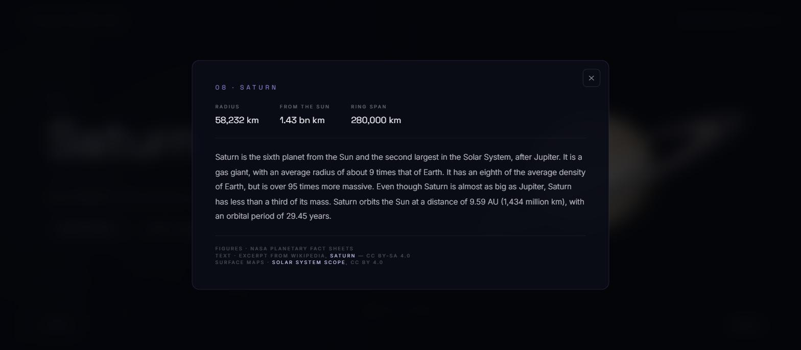
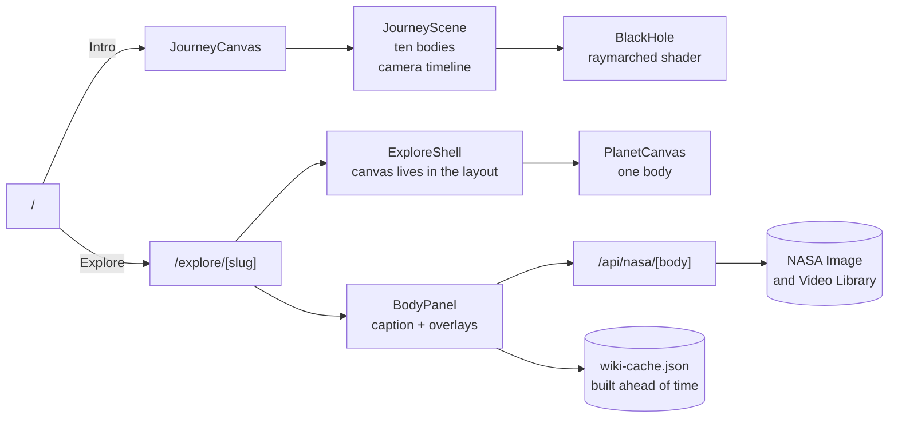
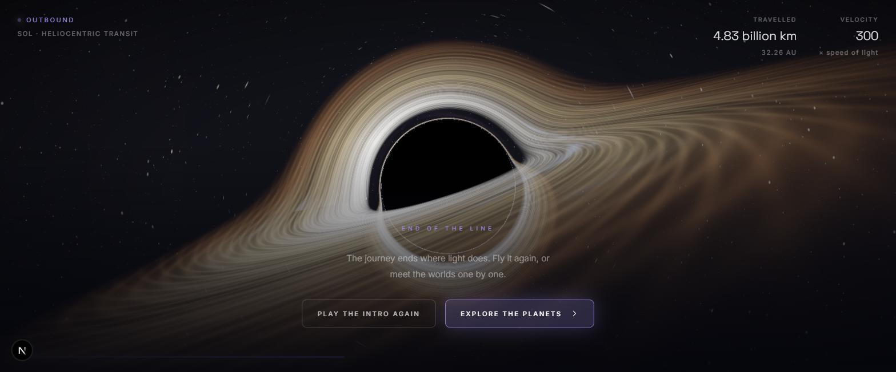

<div align="center">



# Solar System Journey

**A flight from the Sun to Neptune at true spacing, a finale where light gives out,
and an explorer that takes the eleven bodies one at a time.**

[](https://solar-system-journey-plum.vercel.app)
&nbsp;




</div>

---

## Contents

- [What it does](#what-it-does)
- [Screens](#screens)
- [How it works](#how-it-works)
  - [The flight](#the-flight)
  - [Sagittarius A\*](#sagittarius-a)
  - [Explore mode](#explore-mode)
- [Frame rate](#frame-rate)
- [Accessibility](#accessibility)
- [Sources and licences](#sources-and-licences)
- [Getting started](#getting-started)
- [Scripts](#scripts)
- [Project layout](#project-layout)
- [Deploying](#deploying)

---

## What it does

Two modes, one scene language.

| | **Intro** | **Explore** |
|---|---|---|
| Route | `/` | `/explore/[slug]` |
| What | A 20 second flight from the Sun to Neptune | One page per body, shareable link |
| Spacing | **True**, out to 30 AU | n/a |
| Readout | Distance travelled (km / AU) and speed as a multiple of light | Figures, text, NASA archive |
| Ending | Dark, then a light, then a black hole | n/a |

The bodies: **the Sun, Mercury, Venus, Earth, the Moon, Mars, Jupiter, Saturn, Uranus,
Neptune**, and at the end of the flight an eleventh one, **Sagittarius A\***.

---

## Screens

<table>
<tr>
<td width="50%"></td>
<td width="50%"></td>
</tr>
<tr>
<td align="center"><sub><b>Home</b>: fly it or read it, one decision</sub></td>
<td align="center"><sub><b>Explore</b>: the body on the right, the caption on the left</sub></td>
</tr>
<tr>
<td></td>
<td></td>
</tr>
<tr>
<td align="center"><sub><b>Finale</b>: a black hole that actually bends the light</sub></td>
<td align="center"><sub><b>Details</b>: figures, text, attribution</sub></td>
</tr>
</table>

---

## How it works



### The flight

The camera runs down a straight line. The timeline is nothing more than flybys and
cruises laid end to end:

| Phase | Length | What happens |
|---|---|---|
| Flyby | 0.9 s | A steady crawl past the body, the camera holding it in frame |
| Cruise | 1.2 s | A `smoothstep` run to the next one, accelerating out and easing in |
| Dark | 2.4 s | Fog closes, the stars fade, a point of light grows ahead |
| Burst | 0.5 s | The hole closes from 34 rs to 13.5 rs, with a shake and a flash |
| Hold | 1.4 s | The hole settles, the end card lands |

The spacing is real: every body sits at `distanceKm / 1e6`, so Neptune is 4,500 units
out. Radii are exaggerated ten times against that scale, or nothing would be visible at
all. Each body is passed at 3.4 times its own radius, so they all read at the same size,
and no flyby reaches into its neighbour's (the Moon trails Earth by 0.38 units).

> **Skip** does not fast forward the flight, it cuts. Winding it forward threw the whole
> system past the eye in a second, which is a real risk for anyone photosensitive. It now
> jumps straight into the dark, with a 0.55 second fade over the seam.

### Sagittarius A\*

The finale is not sprite work. Photons are integrated through the Schwarzschild field,
one step at a time:

```glsl
vec3 acc = -1.5 * h2 * p / pow(dot(p,p), 2.5);   // h2 = |p × v|²
v += acc * dt;  p += v * dt;
```

Every time a ray crosses the equatorial plane the disc is sampled (2.35 to 16.5 rs), rays
that fall through the horizon stay black, and whatever escapes reads the procedural sky.
The disc wrapping over the top and crossing in front, the photon ring, the lensed arcs
above and below: all of it falls out of that integration, with no hand drawn layer
anywhere. Doppler beaming comes from `beta = 0.72/√r`.

210 steps on desktop, 130 on phones. While the shader owns the frame the pixel ratio is
pinned to 1.0 (0.75 on phones), and the program is compiled in one invisible frame at
load, so the burst never stutters.

### Explore mode

The canvas lives in the **layout**, not the page. Moving from body to body never rebuilds
the WebGL context; only the body in the scene changes. Four inputs share one step: the
wheel (with a 1.1 second cooldown), the arrow keys, a swipe, and the buttons at the
bottom. Neighbouring routes are prefetched.

The paragraph in the details overlay comes from an **en.wikipedia** summary, baked into
`src/data/wiki-cache.json` at build time: the overlay opens with the text already there,
it works with no network, and the wording is reviewable in a diff. It is trimmed at 700
characters, always on a sentence. NASA photographs are live, through a route handler that
caches for 24 hours.

---

## Frame rate

This part was fixed after the fact, and the fixes are worth naming:

| Problem | Before | After |
|---|---|---|
| HUD | The readout called `setState` sixty times a second, reconciling a ten planet tree every time | Values are written straight to the DOM and the canvases are memoised, so the flight renders no React at all |
| Texture memory | 4k maps plus clouds plus a 4k sky, about **130 MB** on the GPU | Resolution is picked from real device pixels, 1k throughout the intro: about **11 MB** |
| Pixel ratio | Fixed at 1.5, which could overshoot the display | Passed as a ceiling, and `PerformanceMonitor` drops it to 1 if the frame rate goes |

Also: anisotropy capped at 8, sphere segments 32 on phones and 64 on desktop,
`frameloop="demand"` when a scene is idle.

---

## Accessibility

- Overlays trap focus, close on `Escape`, and hand focus back where it came from.
- Navigation buttons carry `aria-label`; touch targets are 44 px on phones.
- The 3D canvas is `aria-hidden`. Everything it shows also exists as text in the DOM, and every body page is prerendered as static HTML.
- `prefers-reduced-motion` turns off body rotation, the entrance animation, the camera shake and the burst flash.
- The skip control is a cut, not a strobe (see above).

---

## Sources and licences

| What | Source | Licence |
|---|---|---|
| Surface maps | [Solar System Scope](https://www.solarsystemscope.com/textures/) | CC BY 4.0 |
| Body text | [Wikipedia](https://en.wikipedia.org) summaries | CC BY-SA 4.0 |
| Photographs | [NASA Image and Video Library](https://images.nasa.gov) | NASA media guidelines |
| Figures | NASA planetary fact sheets | n/a |
| Code | This repository | [MIT](LICENSE) |

The attributions are on the site too: three credit lines under every details overlay.

The textures ship as derivatives (`public/textures/{1k,2k,4k}`, webp, about 13 MB in
total). Originals are downloaded into `.cache/` and never committed.

---

## Getting started

```bash
npm install
npm run dev     # http://localhost:3000
```

The repository carries everything it needs to run: textures, the Wikipedia cache, icons.
The network is only used for NASA photographs, and without it the overlay simply says
"No pictures on file".

## Scripts

| Command | What it does |
|---|---|
| `npm run dev` | Development server on Turbopack |
| `npm run build` | Production build (ten body pages, prerendered) |
| `npm start` | Serve the build |
| `npm run lint` | ESLint, React Compiler rules included |
| `node scripts/build-textures.mjs` | Fetch the maps, write 4k/2k/1k webp |
| `node scripts/build-wiki.mjs` | Refresh the Wikipedia summaries |

## Project layout

```
src/
├── app/
│   ├── page.tsx                 the flight
│   ├── explore/
│   │   ├── layout.tsx           where the canvas lives
│   │   └── [slug]/page.tsx      one page per body, with metadata
│   ├── api/nasa/[body]/         NASA search, cached for a day
│   ├── manifest.ts              PWA
│   └── icon.png · apple-icon.png · opengraph-image.png
├── components/
│   ├── journey/                 scene, timeline, HUD
│   ├── explore/                 shell, planet canvas, caption, overlays
│   └── three/                   bodies, stars, black hole, loader
├── data/
│   ├── bodies.ts                figures, copy, texture and wiki titles
│   └── wiki-cache.json          written at build time
├── lib/                         formatting, device preferences, site URL
└── styles/                      Tailwind v4 theme and semantic classes
```

One rule holds the styling together: no long utility chains in JSX. Colours, type and
every `clamp()` value are tokens under `@theme`, and components are built in CSS with
`@apply`.

## Deploying

Vercel needs no configuration. The absolute URL for the share card is read from the
deployment domain itself. Anywhere else, set `NEXT_PUBLIC_SITE_URL`:

```bash
NEXT_PUBLIC_SITE_URL=https://your-domain.com
```

<div align="center">
<br />

<br /><br />
<sub>Made by Taner Talas</sub>
</div>
